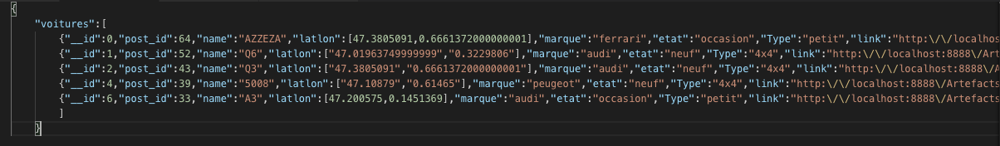
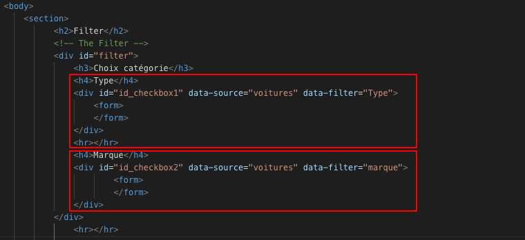
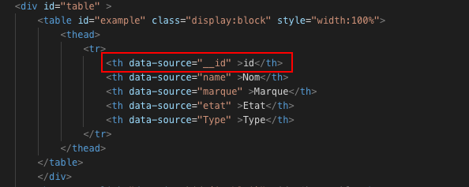
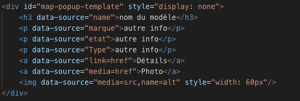
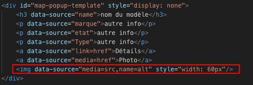
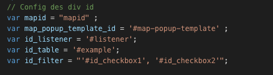
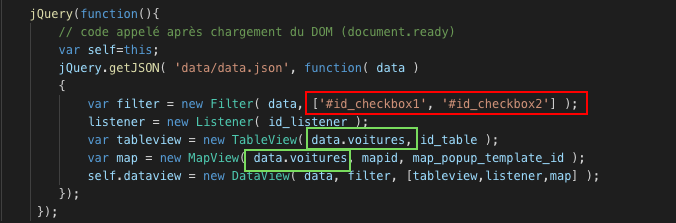

__Requirements__ :

##titre Configuration :
Le fichier data.json est à placer dans /data, sous la forme suivante : 

Toute la configuration se fait dans le fichier index.html;
Avec les points ci-dessous :

- __Filter__ :
Dans le 'div id="filter"', insérer autant de filtres que nécessaire, sous cette forme :

Ici chaque rectangle rouge correspond à un filtre, avec tous les éléments à contenir.
le 'h4' correspondant au filtre choisi;
Ici il faut incrémenter "id_checkbox1" selon le nombre de filtres;
data-source est la source à aller chercher;
data-filter est le paramètre qui sera utilisé comme filtre;

    
- __Table__ :
Configuration des colonnes dans la balise 'tr', sous cette forme : 

Ici le rectangle rouge correspond à une colonne.
Le data-source correspondant au paramètre faisant référence.
Insérer autant de 'th' que nécessaire.

- __Popup__ : 
à configurer sous cette forme : 

data-source est la référence à aller chercher;
possible également sous cette forme :  

ce qui permet d'ajouter un attribut à la balise, ici l'attribut 'src', qui va chercher 'media' comme référence.
Il est possible de mettre autant d'attributs que nécessaire, séparés par ','

- __script__ :
Configuration des ids;

Configuration lors de la création des instances : 

Rectangle rouge : ajouter les div correspondantes au(x) filter(s);
Rectangles verts : modifier selon le type de données, ex: data.commerces, data.entreprises etc.
